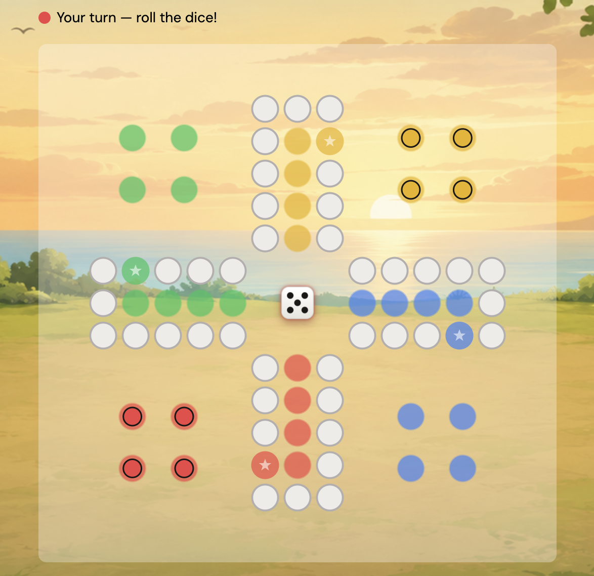

# Ludo 2

A real-time multiplayer Ludo game you can play in the browser with friends. Also known as Mensch ärgere Dich nicht, Parcheesi, Parchís, Pachisi, منچ, and Fia.



## Features

- Real-time multiplayer for up to 8 players
- Play with robots
- Configurable game options
- Available in different languages

## Build

This project uses [Bun](https://bun.sh).

```bash
bun install   # install dependencies
bun run dev   # start in development
bun run build # build for production
```
